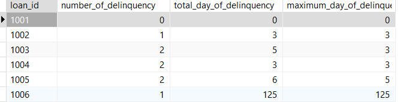

# การวิเคราะห์การชำระเงินล่าช้าของเงินกู้

## คำอธิบายปัญหา

โปรเจกต์นี้ใช้ SQL เพื่อวิเคราะห์ข้อมูลการชำระเงินล่าช้าในระบบจัดการเงินกู้ โดยมีวัตถุประสงค์หลัก ดังนี้:

1. นับจำนวนครั้งที่แต่ละเงินกู้มีการชำระเงินล่าช้า
2. คำนวณจำนวนวันทั้งหมดที่แต่ละเงินกู้มีการชำระล่าช้า
3. หาจำนวนวันสูงสุดที่แต่ละเงินกู้เคยชำระล่าช้า

## การติดตั้ง (Installation)
1. Clone the repo

    ```bash
    git clone https://github.com/ramath-x/loan-late-payment-analysis.git
    cd loan-late-payment-analysis/
    ```
2. Run docker

    ```bash
     docker-compose up -d
    ```

3. เชื่อมต่อ data base (Mysql)

    -  HOST: localhost
    -  DATABASE: finance
    -  USER: user
    -  PASSWORD: user123
    -  PORTS: 3306


## การตั้งค่าฐานข้อมูล

1. สร้างตาราง `transaction` ด้วยโครงสร้างดังนี้:

```sql
CREATE TABLE `transaction` (
    id INT AUTO_INCREMENT PRIMARY KEY,
    loan_id VARCHAR(255),
    effective_date TIMESTAMP, 
    arrears_amount DECIMAL(18,2)
);

```

2. insert ข้อมูล `transaction` ด้วยโครงสร้างดังนี้:

```sql

INSERT INTO `transaction` (loan_id, effective_date, arrears_amount) VALUES
('1001', '2024-01-01 00:00:00', 0),
('1001', '2024-01-02 00:00:00', 100),
('1001', '2024-01-02 00:00:00', 0),
('1002', '2024-01-01 00:00:00', 0),
('1002', '2024-01-02 00:00:00', 100),
('1002', '2024-01-05 00:00:00', 0),
('1003', '2024-01-01 00:00:00', 0),
('1003', '2024-01-02 00:00:00', 100),
('1003', '2024-01-05 00:00:00', 0),
('1003', '2024-02-02 00:00:00', 100),
('1003', '2024-02-04 00:00:00', 0),
('1004', '2024-01-01 00:00:00', 0),
('1004', '2024-01-02 00:00:00', 100),
('1004', '2024-01-05 00:00:00', -150),
('1004', '2024-02-02 00:00:00', -50),
('1004', '2024-02-04 00:00:00', 100),
('1004', '2024-02-04 00:00:00', 0),
('1005', '2024-01-01 00:00:00', 0),
('1005', '2024-01-02 00:00:00', 100),
('1005', '2024-01-05 00:00:00', 200),
('1005', '2024-01-07 00:00:00', 0),
('1005', '2024-01-08 00:00:00', 100),
('1005', '2024-01-09 00:00:00', 0),
('1006', '2024-01-01 00:00:00', 0),
('1006', '2024-02-01 00:00:00', 0),
('1006', '2024-03-15 00:00:00', 200),
('1006', '2024-03-31 00:00:00', 200);

```

3. สร้าง PROCEDURE ชื่อ get_arrears_history () ดังนี้:

```sql
-- DROP PROCEDURE get_arrears_history
DELIMITER //
CREATE PROCEDURE get_arrears_history () BEGIN
	
WITH prev_arrears AS (
	SELECT
		id,
		loan_id,
		effective_date,
		arrears_amount,
		-- เอา arrears_amount ก่อนหน้าของ loan_id
		LAG ( arrears_amount ) OVER ( PARTITION BY loan_id ORDER BY id ) AS prev_arrears 
	FROM
		`transaction` 
	),
	
	late_payments AS ( 
	SELECT * 
	FROM prev_arrears 
	-- เอา เคสที่ แรกที่ยอดเป็น 0  ออก
	WHERE prev_arrears IS NOT NULL 
	-- ยอดติดลบหรือยอดเคงเหลือที่จ่ายออก ออก
	AND NOT ( arrears_amount < 0 AND prev_arrears < 0 ) 
	)
	
	,
	
	delinquency_periods AS ( 
	SELECT *,
	CASE 
			WHEN NOT ( arrears_amount > 0 AND prev_arrears > 0 ) 
				THEN 'top_low' 
			ELSE NULL 
		END 
	FROM late_payments 
	-- เอาแถวระหว่างที่ออกค้างชำระต่อเนื่องออก
	WHERE 
		CASE 
			WHEN NOT ( arrears_amount > 0 AND prev_arrears > 0 ) 
				THEN 'top_low' 
			ELSE NULL 
		END = 'top_low' 
		) ,
		
	arrears_history AS (
	SELECT
		*,
		effective_date AS start_date,
		-- เพิ่มคอลัมน์เพื่อคำนวณระยะเวลาการค้างชำระ
		IFNULL( LEAD ( effective_date ) OVER ( PARTITION BY loan_id ORDER BY id ), CURRENT_DATE ) AS end_date,
-- 	LEAD ( effective_date ) OVER ( PARTITION BY loan_id ORDER BY id )AS end_date,
-- 	ลองดูผล
		DATEDIFF( IFNULL( LEAD ( effective_date ) OVER ( PARTITION BY loan_id ORDER BY id ), CURRENT_DATE ), effective_date ) AS date_diff 
	FROM
		delinquency_periods 
	) 
-- 	SELECT * FROM arrears_history
	SELECT
	loan_id,
	-- กรณีชำระตรงเวลา ไม่มีการค้างชำระ
	IF(
			sum( date_diff ) = 0,	0,count( loan_id )
		) AS number_of_delinquency,
	-- หาจำนวนวันทั้งหมด
	SUM(
			DATEDIFF( end_date, start_date )
		) AS total_day_of_delinquency,
	-- หาจำนวนวันสูงสุดที่เคยค้างชำระ
	MAX(
			DATEDIFF( end_date, start_date )
		) AS maximum_day_of_delinquency 
	FROM
		arrears_history 
	WHERE
		( arrears_amount > 0 AND prev_arrears <= 0 ) 
	GROUP BY
		loan_id;
	END //
	DELIMITER;
```

3. เรียกใช้ get_arrears_history () ที่สร้างเพื่อดูผลลัพธ์:

```sql
CALL get_arrears_history

```

 ##	 รูปผลลัพธ์:



# คำอธิบาย Stored Procedure: get_arrears_history

โครงการนี้ประกอบด้วยสคริปต์ SQL สำหรับการสร้าง Stored Procedure ชื่อ `get_arrears_history` ในฐานข้อมูล MySQL ซึ่งออกแบบมาเพื่อวิเคราะห์ประวัติการค้างชำระของเงินกู้ โดยคำนวณจำนวนครั้งที่ค้างชำระ จำนวนวันที่ค้างชำระทั้งหมด และจำนวนวันที่ค้างชำระสูงสุดสำหรับแต่ละเงินกู้

## โครงสร้างตาราง

Stored Procedure นี้ทำงานบนตาราง `transaction` ซึ่งมีโครงสร้างดังนี้:

- `id` INT AUTO_INCREMENT PRIMARY KEY
- `loan_id` VARCHAR(255)
- `effective_date` TIMESTAMP
- `arrears_amount` DECIMAL(18,2)

## คำอธิบาย Stored Procedure

### ภาพรวม

Stored Procedure `get_arrears_history` ใช้ Common Table Expressions (CTEs) และฟังก์ชันวินโดว์เพื่อคำนวณประวัติการค้างชำระเงิน ขั้นตอนที่เกี่ยวข้องมีดังนี้:

1. **CTE `prev_arrears`**:
    - เลือก `arrears_amount` จากแถวก่อนหน้าสำหรับแต่ละ `loan_id` โดยใช้ฟังก์ชัน `LAG`
    - รูปภาพตัวอย่างการทำงานของ `prev_arrears`:
      
    

2. **CTE `late_payments`**:
    - กรองแถวที่ค่า `prev_arrears` ไม่เป็น NULL เพราะเป็นแถวแรกของ `loan_id`
    - กรองแถวที่ค่า `arrears_amount` และ `prev_arrears` ไม่เป็นค่าติดลบ
    - รูปภาพตัวอย่างการทำงานของ `late_payments`:
      
    

3. **CTE `delinquency_periods`**:
    - กรองช่วงเวลาที่ค้างชำระอย่างต่อเนื่องออก เพื่อคำนวณเวลาระหว่างแถวบนกับแถวล่าง สามารถดูได้จากรูปตัวอย่างของ `loan_id` 1005
    - รูปภาพตัวอย่างการทำงานของ `delinquency_periods`:
      
    

4. **CTE `arrears_history`**:
    - ใช้ฟังก์ชัน `LEAD` เพื่อดึงค่า `effective_date` ของแถวถัดไป
    - เพิ่มคอลัมน์ `date_diff` เพื่อคำนวณระยะเวลาของแต่ละช่วงค้างชำระ ใช้ฟังก์ชัน `IFNULL` ในกรณีที่มีการค้างชำระจนถึงปัจจุบันแล้วยังไม่จ่าย
    - เพิ่มคอลัมน์ `start_date` และ `end_date` เพื่อคำนวณระยะเวลาของแต่ละช่วงค้างชำระ
    - รูปภาพตัวอย่างการทำงานของ `arrears_history`:
      
    

5. **การคำนวณสรุปข้อมูล**:
    - คำนวณจำนวนครั้งที่ค้างชำระ (`number_of_delinquency`)
    - รวมจำนวนวันที่ค้างชำระทั้งหมด (`total_day_of_delinquency`)
    - หาจำนวนวันที่ค้างชำระสูงสุด (`maximum_day_of_delinquency`)
    - กรองแถวที่ค่า `arrears_amount` มากกว่า 0 และ `prev_arrears` ที่น้อยกว่าหรือเท่ากับ 0 เพื่อคำนวณวันที่มีการชำระ
    - รูปภาพตัวอย่างการคำนวณสรุปข้อมูล:
      
    

รูปผลลัพธ์:
- เพิ่มรูปภาพผลลัพธ์ของแต่ละช่วงใน query ตามที่ได้กล่าวถึงเพื่อให้ผู้ชมเห็นภาพรวมของผลลัพธ์ที่ได้จากการทำงานของแต่ละคำสั่ง


